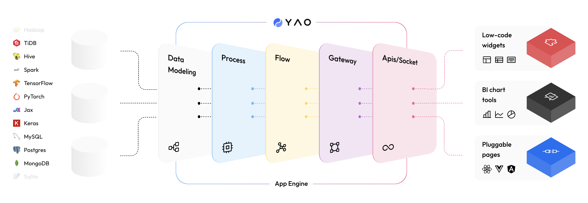

# Yao

[](https://github.com/YaoApp/yao/actions/workflows/unit-test.yml)
[](https://codecov.io/gh/YaoApp/yao)



[English](README.md)

YAO 是一款开源应用引擎，使用 Golang 编写，以一个命令行工具的形式存在, 下载即用。适合用于开发业务系统、网站/APP API 接口、管理后台、自建低代码平台等。

YAO 采用 flow-based 的编程模式，通过编写 YAO DSL (JSON 格式逻辑描述) 或使用 JavaScript 编写处理器，实现各种功能。 YAO DSL 可以有多种编写方式:

1. 纯手工编写

2. 使用自动化脚本，根据上下文逻辑生成

3. 使用可视化编辑器，通过“拖拉拽”制作

官网: [https://yaoapps.com](https://yaoapps.com)

文档: [https://yaoapps.com/doc](https://yaoapps.com/doc)

微信群: 添加微信 17192175099 备注(开发交流)


## 演示

使用 YAO 开发的典型应用

| 应用        | 介绍                 | 代码仓库                              |
| ----------- | -------------------- | ------------------------------------- |
| YAO WMS     | 仓库管理系统         | https://github.com/yaoapp/yao-wms     |
| LMS DEMO    | 图书管理系统(演示)   | https://github.com/yaoapp/demo-lms    |
| CRM DEMO    | 客户管理系统(演示)   | https://github.com/YaoApp/demo-crm    |
| AMS DEMO    | 资产管理系统(演示)   | https://github.com/YaoApp/demo-asset  |
| Widget DEMO | 自建低代码平台(演示) | https://github.com/YaoApp/demo-widget |

## 介绍

Yao 是一个只需使用 JSON 即可创建数据库模型、编写 API 接口、描述管理后台界面的应用引擎，使用 Yao 构建的应用可运行在云端或物联网设备上。 开发者不需要写一行代码，就可以拥有 10 倍生产力。

Yao 基于 **flow-based** 编程思想，采用 **Go** 语言开发，支持多种方式扩展数据流处理器。这使得 Yao 具有极好的**通用性**，大部分场景下可以代替编程语言, 在复用性和编码效率上是传统编程语言的 **10 倍**；应用性能和资源占比上优于 **PHP**, **JAVA** 等语言。

Yao 内置了一套数据管理系统，通过编写 **JSON** 描述界面布局，即可实现 90% 常见界面交互功能，特别适合快速制作各类管理后台、CRM、ERP 等企业内部系统。对于特殊交互功能亦可通过编写扩展组件或 HTML 页面的方式实现。内置管理系统与 Yao 并不耦合，亦可采用 **VUE**, **React** 等任意前端技术实现管理界面。

## Install

在终端下运行脚本: ( MacOS / Linux )

```bash
curl -fsSL https://website.yaoapps.com/install.sh | bash
```

Windows 用户请参考安装调试章节: [安装调试](https://yaoapps.com/doc/a.介绍/b.安装调试)

## 入门指南

### Step 1: 创建项目

新建一个项目目录，进入项目目录，运行 `yao init` 命令，创建一个空白的 Yao 应用。

```bash
mkdir -p /data/crm  # 创建项目目录
cd /data/crm  # 进入项目目录
yao init # 运行初始化程序
```

命令运行成功后，将创建 `app.json文件` , `db`, `ui` , `data` 等目录

```bash
├── data        # 用于存放应用产生的文件，如图片,PDF等
├── db          # 用于存放 SQLite 数据库文件
│   └── yao.db
└── ui          # 静态文件服务器文件目录，可以放置自定义前端制品，该目录下文件可通过 http://host:port/文件名称 访问。
└── app.json    # 应用配置文件, 用来定义应用名称等
```

### Step 2: Create the data table

使用 `yao migrate` 命令创建数据表，打开命令行终端，**在项目根录下运行**:

```bash
yao migrate
```

初始化菜单

```bash
yao run flows.setmenu
```

### Step 3: Start the service

打开命令行终端，**在项目根录下运行**:

```bash
yao start
```

1. 打开浏览器, 访问 `https://127.0.0.1:5099/xiang/login/admin`，

2. 输入默认用户名: `xiang@iqka.com`， 密码: `A123456p+`

## 关于 Yao

Yao 的名字源于汉字**爻(yáo)**，是构成八卦的基本符号。八卦，是上古大神伏羲观测总结自然规律后，创造的一个可以指代万事万物的符号体系。爻，有阴阳两种状态，就像 0 和 1。爻的阴阳转换，驱动八卦更替，以此来总结记录事物的发展规律。
